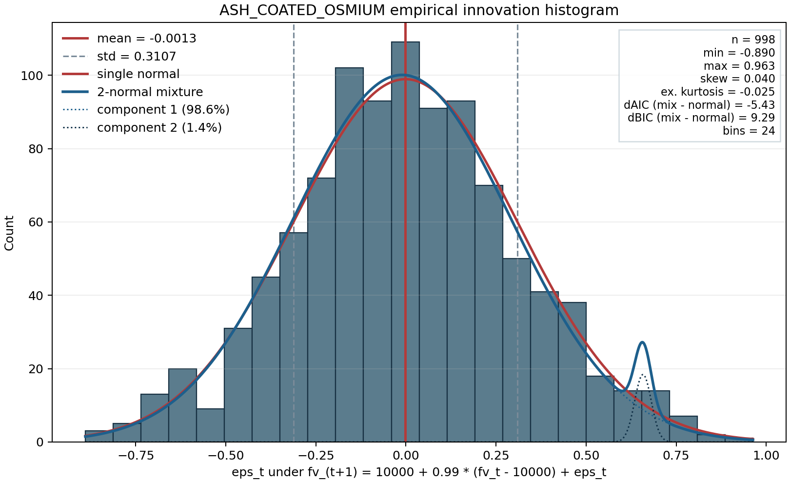
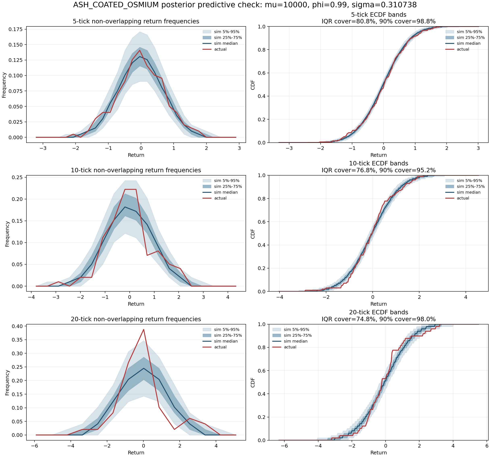
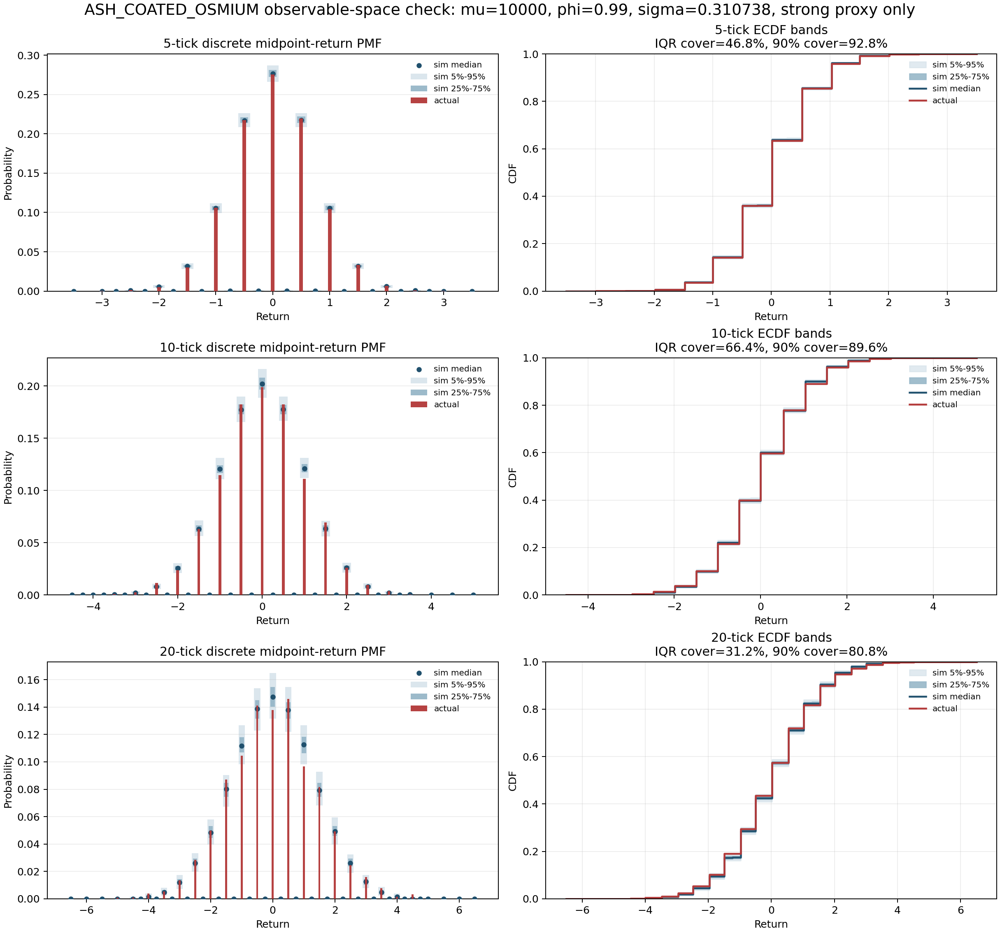

# ASH_COATED_OSMIUM Calibration

## Inputs

- Hold-one submission log: `~/Downloads/one_osmium/113498.json`
- True price reconstruction: `true_price_t = 10011 + pnl_t`
  - `10011` is inferred from the cash leg in the final positions.
  - The first activity row is pre-fill, so valid hidden-price points start at
    `t=100`.

## Hidden Fair Value

Recovered hidden fair value lives on a `1/1024` grid.

Empirically on this path:

- mean: `9999.8750`
- min / max: `9993.7607` to `10003.7725`
- AR(1) fit around the mean: `phi ~= 0.9895`
- innovation std: `0.3107`

Interpretation:

- unlike `INTARIAN_PEPPER_ROOT`, this is not a deterministic trend
- it looks like a stationary / mean-reverting latent process
- the exact realized path is recovered from the hold-one log, but one path is
  not enough to uniquely identify the generator beyond "strongly mean-reverting"

## Transition Law

The hidden path is consistent with a simple AR(1) / discrete OU update around a
fixed mean of `10000`:

```python
fv_next = float32(10000.0 + 0.99 * (fv - 10000.0) + normal(0, sigma))
```

with `sigma ~= 0.31`.

Why this is the leading hypothesis:

- forcing the long-run mean to exactly `10000` barely changes fit quality
- forcing `phi = 0.99` also barely changes fit quality versus the unconstrained
  AR(1) estimate
- the exact hidden values lie on a `1/1024` grid, which is exactly the float32
  spacing at this price scale
- residuals under the `mu = 10000`, `phi = 0.99` model are close to Gaussian
  and show no meaningful serial correlation

Exact fit numbers on the recovered path:

- unconstrained AR(1): `alpha = 105.4163`, `phi = 0.989458`, implied
  `mu = alpha / (1 - phi) = 9999.8737`, residual std `0.310734`
- fixed `mu = 10000`: `phi = 0.989495`, residual std `0.310737`
- fixed `mu = 10000`, `phi = 0.99`: residual std `0.310738`
- residual skew: `0.040`
- residual excess kurtosis: `-0.025`
- residual autocorrelation at lags `1, 2, 3, 5, 10, 20`:
  `0.005, 0.028, -0.031, -0.066, -0.023, 0.052`

So the data supports the simpler coded rule much more strongly than a
sample-specific fitted rule like

```python
fv_next = 105.4163 + 0.989458 * fv + eps
```

The exact innovation scale is still not uniquely identified from one path. The
continuous MLE is `0.3107`, while a "nice" constant such as `0.3125` is still
plausible.

## Empirical Innovation Histogram

For the simplified production model

```python
eps_t = fv_{t+1} - (10000 + 0.99 * (fv_t - 10000))
```

the realized `eps_t` sample on the recovered hold-one path is:



Summary of the realized innovations:

- sample count: `998`
- mean: `-0.0013`
- std: `0.3107`
- min / max: `-0.8897` to `0.9631`
- skew: `0.040`
- excess kurtosis: `-0.025`
- 1% / 99% quantiles: `-0.7271` / `0.7052`

So this is the actual empirical histogram behind the current "Gaussian eps"
approximation; visually it is close to bell-shaped, but this figure is the
right object to calibrate from rather than the assumption itself.

## Two-Normal Mixture Fit

If we force a two-component Gaussian mixture onto the same `eps_t` sample, the
best unconstrained EM fit is

```python
eps_t ~ 0.9862 * Normal(-0.0105, 0.3029^2) + 0.0138 * Normal(0.6579, 0.0231^2)
```

Interpretation:

- the first component is basically the original single-normal fit
- the second component is tiny, with only about `13.8` soft-assigned samples
  out of `998`
- in practice it is just peeling off a small cluster of unusually large
  positive innovations rather than revealing a cleanly bimodal distribution

Fit comparison against the single normal:

- single normal AIC / BIC: `503.25` / `513.06`
- two-normal mixture AIC / BIC: `497.82` / `522.35`

So the mixture improves AIC slightly, but BIC gets worse. That means a
two-normal model is possible, but the evidence for a genuinely two-regime
innovation process is weak; the extra flexibility mainly captures the rare
right-tail spikes.

## Posterior Predictive Check For The Original Normal Model

Using the original latent update

```python
fv_next = float32(10000.0 + 0.99 * (fv - 10000.0) + normal(0, 0.310738))
```

I simulated `1000` latent FV paths, each with the same length as the recovered
hold-one osmium path (`999` post-fill points), and compared non-overlapping
return distributions at horizons `5`, `10`, and `20`.



ECDF-band coverage of the actual return distribution versus the simulated
ensemble:

- `5` ticks: inside simulated IQR on `80.8%` of grid points, inside simulated
  `5%-95%` band on `98.8%`
- `10` ticks: inside simulated IQR on `76.8%`, inside simulated `5%-95%` band
  on `95.2%`
- `20` ticks: inside simulated IQR on `74.8%`, inside simulated `5%-95%` band
  on `98.0%`

Additional checks:

- return std is inside the simulated IQR at all three horizons
- Wasserstein and KS distances from actual-to-simulated are typical relative to
  simulated-to-simulated distances
- the main miss is the `10`-tick left tail: actual `q05 = -1.2945`, slightly
  above the simulated `95%` cutoff of `-1.3179`, so the realized left tail is a
  bit lighter than the model expects at that horizon

So on this posterior predictive check, the original single-normal innovation
model looks reasonable. The observed path is not unusually far from the model's
own simulated family, even though some tail quantiles are a bit asymmetric on
this one sample.

## Observable-Space Check Using All Visible Osmium Data

The latent-only check above still uses just one recovered hidden path. To use
the full round-1 osmium dataset, I built an observable-space proxy from the
visible book itself:

- for each osmium tick across days `-2`, `-1`, and `0`, solve for the feasible
  FV interval implied by the visible inner / outer quotes
- keep the strong cases where that interval has width exactly `0.5`
- use the interval midpoint as the empirical observable

This produces `27,707` strong observable ticks out of `30,000` total
(`92.36%` coverage), so it is much larger than the `999`-point hold-one latent
sample.

The simulated side uses the original normal innovation model

```python
fv_next = float32(10000.0 + 0.99 * (fv - 10000.0) + normal(0, 0.310738))
```

but conditions on the actual per-tick inner / outer visibility mask from the
real book. So this check isolates the latent process while using all the
observable price data, without yet needing a separate presence-process model.



ECDF-band coverage of the actual book-implied midpoint return distribution:

- `5` ticks: inside simulated IQR on `46.8%` of grid points, inside simulated
  `5%-95%` band on `92.8%`
- `10` ticks: inside simulated IQR on `66.4%`, inside simulated `5%-95%` band
  on `89.6%`
- `20` ticks: inside simulated IQR on `31.2%`, inside simulated `5%-95%` band
  on `80.8%`

Additional diagnostics:

- Wasserstein / KS distances are still within the simulated family, with actual
  median distance percentiles of about `39%` / `32%` at `5` ticks, `48%` /
  `42%` at `10` ticks, and `73%` / `56%` at `20` ticks
- the observable return quantiles are heavily quantized by the `0.5`-width
  midpoint proxy, so `q05`, `q50`, and `q95` line up almost exactly at `5` and
  `10` ticks
- the main miss is dispersion at longer horizons: actual std is above the
  simulated IQR at all three horizons, and above the simulated `95%` cutoff at
  `20` ticks (`1.4136` actual versus `1.3909` simulated `p95`)

So the stronger all-data check is more skeptical than the latent-only check.
The original Gaussian innovation model still looks broadly plausible at short
horizons, but it appears slightly under-dispersed once the full observable book
data is aggregated, especially around `20`-tick returns.

## Visible-Book Validation

Using the visible osmium quotes alone, the inner and outer layers identify a
latent fair-value interval on most ticks. On the first `999` post-fill ticks of
day `0`:

- a non-empty FV interval is recovered on `846` ticks
- every recovered interval contains the exact hidden FV from the hold-one log
- interval width is always `0.5`
- interval midpoint RMSE versus exact hidden FV is `0.1414`
- maximum midpoint error is `0.2471`

This is strong evidence that the quote-layer rules are correct, and that the
remaining uncertainty is in the latent transition noise rather than in the
visible book mapping.

## Outer Wall

Conditional on a visible level with `9.5 < |price - FV| < 11.5`:

```python
bid = floor(FV) - 10
ask = ceil(FV) + 10
vol = randint(20, 30)   # same value on both sides when both sides are present
```

Validation on extracted wall events:

- bid match: `791 / 793` (`99.7%`)
- ask match: `778 / 778` (`100.0%`)
- both match: `627 / 628` (`99.8%`)
- spreads: `21` on `626` rows, `20` on `2` rows
- volume support: `20..30`
- uniformity check over `20..30`: chi-squared `5.87` (consistent with uniform)
- bid / ask volume equality on same tick: `628 / 628`

Notes:

- the dominant spread is `21` because `ceil(FV) - floor(FV) = 1` almost always
- the two `20`-spread rows are boundary cases

## Inner Quote

Conditional on a visible level with `7 < |price - FV| < 9`:

```python
bid = round(FV) - 8
ask = round(FV) + 8
vol = randint(10, 15)   # same value on both sides when both sides are present
```

Validation on extracted inner-layer events:

- bid match: `758 / 758` (`100.0%`)
- ask match: `806 / 806` (`100.0%`)
- both match: `618 / 618` (`100.0%`)
- spread: always `16`
- volume support: `10..15`
- uniformity check over `10..15`: chi-squared `3.28` (consistent with uniform)
- bid / ask volume equality on same tick: `618 / 618`

## Near-FV One-Sided Bot

This is a rare, almost always single-sided quote near fair value.

Observed behavior:

- presence: `76 / 999` timestamps (`7.6%`)
- events: `78` total
- side split: `40` bid, `38` ask
- run lengths: `66` runs of length `1`, `5` runs of length `2`

Price rule is much cleaner against `floor(FV)` than against `round(FV)`:

```python
price = floor(FV) + choice([-2, +2])
```

Conditioned structure:

- passive bid: `floor(FV) - 2`, volume roughly `1..5`
- aggressive bid: `floor(FV) + 2`, volume roughly `4..10`
- passive ask: `floor(FV) + 2`, volume roughly `2..5`
- aggressive ask: `floor(FV) - 2`, volume roughly `4..10`

So the simplest model is:

```python
if random.random() < 0.076:
    side = random.choice(["bid", "ask"])
    aggressive = random.choice([False, True])
    sign = 1 if (side == "bid" and aggressive) or (side == "ask" and not aggressive) else -1
    price = floor(FV) + 2 * sign
    vol = randint(4, 10) if aggressive else randint(1, 5)
```

This is less clean than the symmetric inner / outer layers, but the
side-conditioned price law is consistent throughout the sample.

## Open Question

The visible book often shows only one side of the inner or outer layer on a
given tick. The price rules above are exact conditional on visibility, but the
presence process still needs a separate model.
